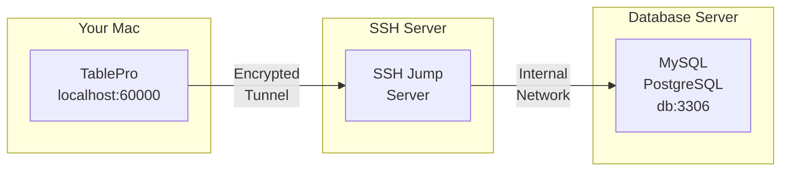

# SSH Tunneling

SSH tunneling allows you to securely connect to databases on remote servers that aren't directly accessible from your Mac. TablePro creates an encrypted tunnel through an SSH server to reach your database.

## How SSH Tunneling Works



1. TablePro creates an SSH connection to your jump server
2. A local port (e.g., 60000) forwards through the tunnel
3. Traffic is encrypted between your Mac and the SSH server
4. The SSH server connects to the database on your behalf

## When to Use SSH Tunneling

- Database server is in a private network
- Database server only accepts local connections
- You need to encrypt connections to the database
- You want to access databases through a bastion/jump host

## Setting Up SSH Tunneling

<Steps>
  <Step title="Create or Edit Connection">
    Open the connection form for your database
  </Step>
  <Step title="Enable SSH Tunnel">
    Toggle the **SSH Tunnel** switch to ON
  </Step>
  <Step title="Configure SSH Settings">
    Enter your SSH server details and authentication
  </Step>
  <Step title="Test and Connect">
    Click **Test Connection** to verify the tunnel works
  </Step>
</Steps>

{/* Screenshot: Connection form with SSH section expanded */}
<Frame caption="SSH tunnel configuration">
  
  
</Frame>

## SSH Configuration Options

### SSH Server Settings

| Field | Description | Default |
|-------|-------------|---------|
| **SSH Host** | SSH server hostname or IP | - |
| **SSH Port** | SSH server port | `22` |
| **SSH User** | SSH username | - |

### Authentication Methods

TablePro supports two SSH authentication methods:

<Tabs>
  <Tab title="Password">
    Simple password authentication:

    | Field | Description |
    |-------|-------------|
    | **SSH Pass** | Your SSH password |

    <Warning>
    Password authentication is less secure than key-based authentication. Consider using SSH keys for production servers.
    </Warning>
  </Tab>
  <Tab title="Private Key">
    More secure key-based authentication:

    | Field | Description |
    |-------|-------------|
    | **Key File** | Path to your private key (e.g., `~/.ssh/id_rsa`) |
    | **Passphrase** | Key passphrase (if encrypted) |

    <Tip>
    Click **Browse** to select your private key file. TablePro looks in `~/.ssh/` by default.
    </Tip>
  </Tab>
</Tabs>

{/* Screenshot: SSH authentication methods */}
<Frame caption="SSH authentication: Password and Private Key options">
  
  
</Frame>

### Using SSH Config

If you have entries in your `~/.ssh/config` file, TablePro can use them:

1. TablePro reads your SSH config automatically
2. Select a host from the **SSH Host** dropdown
3. Settings are auto-filled from your config

Example SSH config entry:

```
# ~/.ssh/config
Host production-jump
    HostName jump.example.com
    User deploy
    Port 22
    IdentityFile ~/.ssh/production_key
```

This appears as "production-jump" in the SSH Host dropdown.

{/* Screenshot: SSH config hosts */}
<Frame caption="SSH hosts imported from ~/.ssh/config">
  
  
</Frame>

## Database Connection Settings

When using SSH tunneling, the database host is relative to the SSH server:

| Field | Value | Description |
|-------|-------|-------------|
| **Host** | `localhost` or `127.0.0.1` | Database is on the SSH server itself |
| **Host** | `db.internal` | Database is on internal network |
| **Port** | `3306`, `5432`, etc. | Database port (unchanged) |

<Note>
The database host should be what the SSH server uses to reach the database, not what your Mac would use.
</Note>

### Common Scenarios

#### Database on SSH Server

The database runs on the same machine as your SSH server:

```
SSH Host:       jump.example.com
SSH User:       deploy

Database Host:  localhost
Database Port:  3306
```

#### Database on Internal Network

The database is on a different server, only accessible from the SSH server:

```
SSH Host:       jump.example.com
SSH User:       deploy

Database Host:  db.internal.example.com
Database Port:  5432
```

#### AWS RDS via Bastion

Connecting to RDS through an EC2 bastion host:

```
SSH Host:       bastion.example.com
SSH User:       ec2-user
Key File:       ~/.ssh/aws-key.pem

Database Host:  mydb.abc123.us-east-1.rds.amazonaws.com
Database Port:  5432
```

## SSH Key Setup

### Generating SSH Keys

If you don't have SSH keys:

```bash
# Generate a new key pair
ssh-keygen -t ed25519 -C "your_email@example.com"

# Or use RSA for broader compatibility
ssh-keygen -t rsa -b 4096 -C "your_email@example.com"
```

### Key Locations

Default key locations on macOS:

| Key Type | Private Key | Public Key |
|----------|-------------|------------|
| Ed25519 | `~/.ssh/id_ed25519` | `~/.ssh/id_ed25519.pub` |
| RSA | `~/.ssh/id_rsa` | `~/.ssh/id_rsa.pub` |
| ECDSA | `~/.ssh/id_ecdsa` | `~/.ssh/id_ecdsa.pub` |

### Adding Key to Server

Copy your public key to the SSH server:

```bash
# Using ssh-copy-id
ssh-copy-id -i ~/.ssh/id_ed25519.pub user@server

# Or manually
cat ~/.ssh/id_ed25519.pub | ssh user@server "mkdir -p ~/.ssh && cat >> ~/.ssh/authorized_keys"
```

### Key Permissions

SSH keys must have correct permissions:

```bash
# Fix permissions
chmod 700 ~/.ssh
chmod 600 ~/.ssh/id_*
chmod 644 ~/.ssh/id_*.pub
chmod 644 ~/.ssh/config
```

## Troubleshooting

### Connection Refused

**Symptoms**: "Connection refused" when testing SSH tunnel

**Causes and Solutions**:

1. **SSH server not running**
   ```bash
   # Test SSH connection directly
   ssh -v user@server
   ```

2. **Wrong port**
   - Verify SSH port (some servers use non-standard ports)
   - Check with server administrator

3. **Firewall blocking connection**
   - Ensure port 22 (or custom port) is open
   - Check both local and server firewalls

### Authentication Failed

**Symptoms**: "SSH authentication failed" or "Permission denied"

**For Password Authentication**:
1. Verify username and password
2. Check if password auth is enabled on server
3. Try connecting via terminal: `ssh user@server`

**For Key Authentication**:
1. Verify key file path is correct
2. Check key permissions (`chmod 600`)
3. Ensure public key is in server's `authorized_keys`
4. Verify passphrase (if key is encrypted)
5. Try connecting via terminal:
   ```bash
   ssh -i ~/.ssh/your_key user@server
   ```

### Private Key Errors

**"Private key file not found"**:
- Verify the path exists
- Use the Browse button to select the file

**"Private key file is not readable"**:
```bash
chmod 600 ~/.ssh/your_key
```

**"Wrong passphrase"**:
- Re-enter the passphrase
- Test key manually: `ssh-keygen -y -f ~/.ssh/your_key`

### Tunnel Established but Database Fails

If SSH tunnel connects but database connection fails:

1. **Verify database host is correct** (relative to SSH server)
   ```bash
   # From SSH server, test database connection
   ssh user@server "mysql -h localhost -u dbuser -p"
   ```

2. **Check database port**
   - Ensure port matches the database server's actual port

3. **Verify database credentials**
   - Username/password might be different from SSH credentials

### Tunnel Drops Periodically

TablePro includes keep-alive settings to prevent tunnel drops:

- `ServerAliveInterval=60` - Send keep-alive every 60 seconds
- `ServerAliveCountMax=3` - Disconnect after 3 missed responses

If tunnels still drop:
1. Check network stability
2. Verify server's `ClientAliveInterval` setting
3. Check for idle timeout settings on firewalls

{/* Screenshot: SSH tunnel active */}
<Frame caption="Active SSH tunnel status indicator">
  
  
</Frame>

## Security Considerations

### Best Practices

1. **Use key-based authentication** instead of passwords
2. **Use Ed25519 or RSA keys** with 4096+ bits
3. **Protect your private keys** with a passphrase
4. **Limit SSH access** to specific users/IPs on the server
5. **Use a dedicated jump host** rather than direct database access

### What Gets Encrypted

| Data | Encrypted |
|------|-----------|
| SSH connection | Yes |
| Database credentials | Yes (through tunnel) |
| Query data | Yes (through tunnel) |
| Local stored passwords | Yes (macOS Keychain) |

### What to Avoid

- Don't share private keys
- Don't use password authentication on production servers
- Don't store SSH passwords in plain text
- Don't expose database ports directly to the internet

## Advanced: SSH Agent

If you use SSH Agent for key management:

1. Add your key to the agent:
   ```bash
   ssh-add ~/.ssh/id_ed25519
   ```

2. TablePro can use keys from SSH Agent automatically
3. You won't need to enter passphrases repeatedly

## Next Steps

<CardGroup cols={2}>
  <Card title="MySQL Connection" icon="database" href="/databases/mysql">
    MySQL-specific settings and features
  </Card>
  <Card title="PostgreSQL Connection" icon="database" href="/databases/postgresql">
    PostgreSQL-specific settings and features
  </Card>
  <Card title="Connection Management" icon="plug" href="/databases/overview">
    Managing all your connections
  </Card>
  <Card title="Keyboard Shortcuts" icon="keyboard" href="/features/keyboard-shortcuts">
    Speed up your workflow
  </Card>
</CardGroup>
