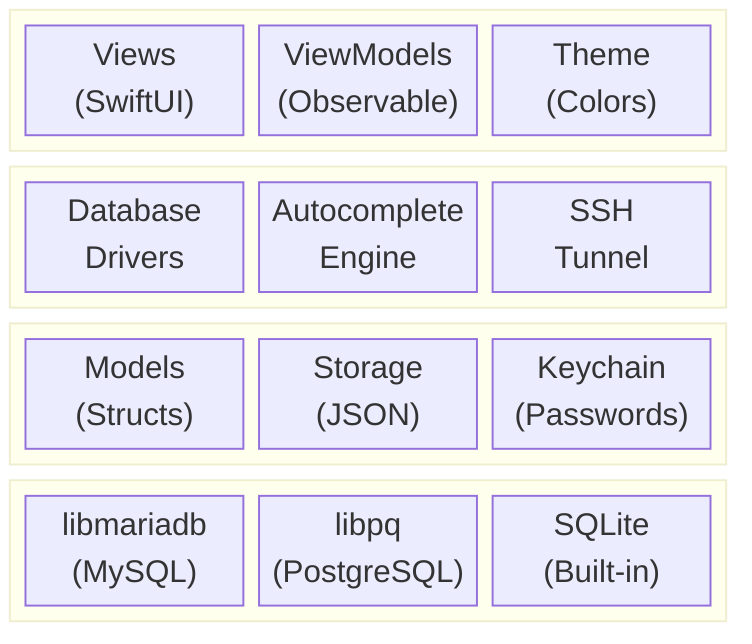
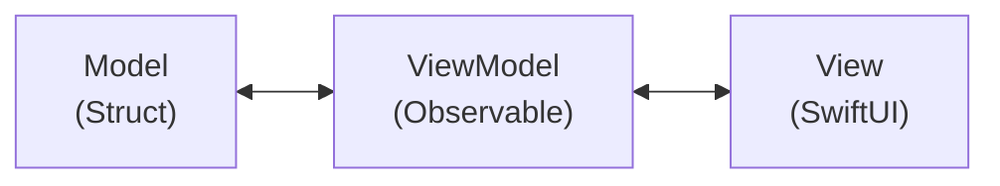
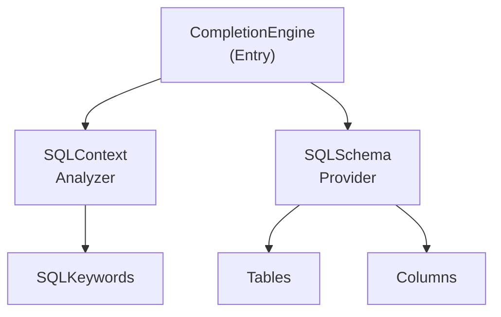
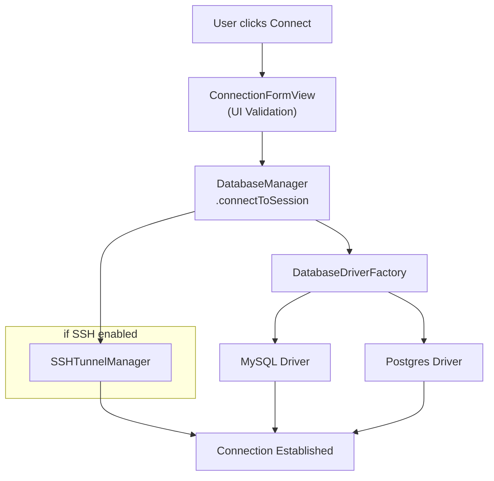
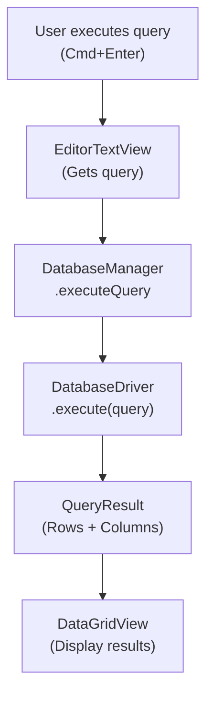

# Architecture

This guide explains TablePro's architecture, design patterns, and how different components work together.

## Overview

TablePro is built with:

- **SwiftUI** for the user interface
- **AppKit** for low-level macOS integration
- **Swift Concurrency** (async/await, actors) for concurrent operations
- **Native database libraries** for database connectivity



## Dependencies

TablePro uses Swift Package Manager (SPM) for third-party dependencies:

| Package | Version | Purpose |
|---------|---------|---------|
| **CodeEditSourceEditor** | 0.15.2+ | Tree-sitter-powered code editor component for the SQL editor |
| **Sparkle** | 2.x | Auto-update framework with EdDSA signing |

<Note>
CodeEditSourceEditor bundles a SwiftLint plugin that requires `-skipPackagePluginValidation` for CLI builds. See the [Building](/development/building) guide for details.
</Note>

## Directory Structure

<Tree>
  <Tree.Folder name="TablePro" defaultOpen>
    <Tree.Folder name="Models">
      <Tree.File name="DatabaseConnection.swift" />
      <Tree.File name="QueryResult.swift" />
      <Tree.File name="TableInfo.swift" />
      <Tree.File name="AppSettings.swift" />
    </Tree.Folder>
    <Tree.Folder name="Views">
      <Tree.Folder name="Main" />
      <Tree.Folder name="Connection" />
      <Tree.Folder name="Editor" />
      <Tree.Folder name="Results" />
      <Tree.Folder name="Structure" />
      <Tree.Folder name="Settings" />
      <Tree.Folder name="Welcome" />
    </Tree.Folder>
    <Tree.Folder name="ViewModels">
      <Tree.File name="DatabaseManager.swift" />
    </Tree.Folder>
    <Tree.Folder name="Core">
      <Tree.Folder name="Database">
        <Tree.File name="DatabaseDriver.swift" />
        <Tree.File name="MySQLDriver.swift" />
        <Tree.File name="PostgreSQLDriver.swift" />
        <Tree.File name="SQLiteDriver.swift" />
      </Tree.Folder>
      <Tree.Folder name="Autocomplete">
        <Tree.File name="CompletionEngine.swift" />
        <Tree.File name="SQLContextAnalyzer.swift" />
        <Tree.File name="SQLKeywords.swift" />
      </Tree.Folder>
      <Tree.Folder name="SSH">
        <Tree.File name="SSHTunnelManager.swift" />
      </Tree.Folder>
    </Tree.Folder>
    <Tree.Folder name="Extensions" />
    <Tree.Folder name="Theme">
      <Tree.File name="Theme.swift" />
    </Tree.Folder>
    <Tree.Folder name="Resources" />
  </Tree.Folder>
</Tree>

## Design Patterns

### MVVM Architecture

TablePro uses Model-View-ViewModel (MVVM):



**Models**: Pure data structures (structs, enums)
```swift
struct DatabaseConnection: Codable, Identifiable {
    let id: UUID
    var name: String
    var host: String
    var port: Int
    var type: DatabaseType
}
```

**ViewModels**: Observable state containers
```swift
@MainActor
class DatabaseManager: ObservableObject {
    @Published var sessions: [DatabaseSession] = []
    @Published var activeSessionId: UUID?

    func connect(to connection: DatabaseConnection) async throws {
        // Business logic
    }
}
```

**Views**: SwiftUI declarative UI
```swift
struct ConnectionFormView: View {
    @StateObject private var dbManager = DatabaseManager.shared

    var body: some View {
        Form {
            // UI elements
        }
    }
}
```

### Protocol-Oriented Design

Database drivers follow a protocol:

```swift
protocol DatabaseDriver: AnyObject {
    var connection: DatabaseConnection { get }
    var status: ConnectionStatus { get }

    func connect() async throws
    func disconnect()
    func execute(query: String) async throws -> QueryResult
    func fetchTables() async throws -> [TableInfo]
    // ...
}
```

Implementations:

```swift
class MySQLDriver: DatabaseDriver { ... }
class PostgreSQLDriver: DatabaseDriver { ... }
class SQLiteDriver: DatabaseDriver { ... }
```

### Actor Isolation

Concurrent operations use Swift actors:

```swift
actor SSHTunnelManager {
    static let shared = SSHTunnelManager()

    private var tunnels: [UUID: SSHTunnel] = [:]

    func createTunnel(
        connectionId: UUID,
        sshHost: String,
        // ...
    ) async throws -> Int {
        // Thread-safe tunnel management
    }
}
```

### Factory Pattern

Driver creation uses a factory:

```swift
enum DatabaseDriverFactory {
    static func createDriver(for connection: DatabaseConnection) -> DatabaseDriver {
        switch connection.type {
        case .mysql, .mariadb:
            return MySQLDriver(connection: connection)
        case .postgresql:
            return PostgreSQLDriver(connection: connection)
        case .sqlite:
            return SQLiteDriver(connection: connection)
        }
    }
}
```

## Key Components

### DatabaseManager

Central manager for database operations:

- Manages active sessions
- Coordinates connections/disconnections
- Handles SSH tunnel lifecycle
- Publishes state changes to UI

```swift
@MainActor
class DatabaseManager: ObservableObject {
    static let shared = DatabaseManager()

    @Published var sessions: [DatabaseSession] = []
    @Published var activeSessionId: UUID?

    func connectToSession(_ connection: DatabaseConnection) async throws
    func disconnectSession(_ id: UUID) async
    func executeQuery(_ query: String) async throws -> QueryResult
}
```

### Database Drivers

Each driver encapsulates database-specific logic:

| Driver | Library | Protocol |
|--------|---------|----------|
| MySQLDriver | libmariadb | MySQL wire protocol |
| PostgreSQLDriver | libpq | PostgreSQL protocol |
| SQLiteDriver | Built-in SQLite3 | File-based |

### Autocomplete Engine

The autocomplete system:



- **CompletionEngine**: Main entry point
- **SQLContextAnalyzer**: Parses query context
- **SQLSchemaProvider**: Provides schema information
- **SQLKeywords**: SQL keyword definitions

### SSH Tunnel Manager

Manages SSH tunnels as an actor:

```swift
actor SSHTunnelManager {
    private var tunnels: [UUID: SSHTunnel] = [:]

    func createTunnel(...) async throws -> Int
    func closeTunnel(connectionId: UUID) async throws
    func hasTunnel(connectionId: UUID) -> Bool
}
```

Features:
- Port forwarding via system `ssh`
- Password and key authentication
- Health monitoring
- Automatic cleanup

## Data Flow

### Connection Flow



### Query Execution Flow



## State Management

### Published Properties

UI state is managed with `@Published`:

```swift
@MainActor
class DatabaseManager: ObservableObject {
    @Published var sessions: [DatabaseSession] = []
    @Published var activeSessionId: UUID?
    @Published var isConnecting = false
}
```

### App Storage

Settings use `@AppStorage` for persistence:

```swift
@AppStorage("appearance.theme") var theme: AppTheme = .system
@AppStorage("editor.fontSize") var fontSize: Int = 13
```

### Environment

Shared state via SwiftUI environment:

```swift
@main
struct TableProApp: App {
    @StateObject private var dbManager = DatabaseManager.shared

    var body: some Scene {
        WindowGroup {
            ContentView()
                .environmentObject(dbManager)
        }
    }
}
```

## Error Handling

### Driver Errors

Each driver defines specific errors:

```swift
enum MySQLError: Error, LocalizedError {
    case connectionFailed(String)
    case queryFailed(String)
    case authenticationFailed

    var errorDescription: String? {
        switch self {
        case .connectionFailed(let msg): return "Connection failed: \(msg)"
        case .queryFailed(let msg): return "Query failed: \(msg)"
        case .authenticationFailed: return "Authentication failed"
        }
    }
}
```

### Error Propagation

Errors propagate up through async/await:

```swift
func executeQuery(_ query: String) async throws -> QueryResult {
    guard let driver = activeDriver else {
        throw DatabaseError.notConnected
    }
    return try await driver.execute(query: query)
}
```

## Testing

### Unit Tests

Tests are in `TableProTests/`:

```swift
final class MySQLDriverTests: XCTestCase {
    func testConnectionString() throws {
        let connection = DatabaseConnection(...)
        let driver = MySQLDriver(connection: connection)
        XCTAssertEqual(driver.connectionString, "expected")
    }
}
```

### Integration Tests

For database tests:

```swift
func testExecuteQuery() async throws {
    let driver = MySQLDriver(connection: testConnection)
    try await driver.connect()
    defer { driver.disconnect() }

    let result = try await driver.execute(query: "SELECT 1")
    XCTAssertEqual(result.rowCount, 1)
}
```

## Next Steps

<CardGroup cols={2}>
  <Card title="Code Style" icon="code" href="/development/code-style">
    Coding conventions and style guide
  </Card>
  <Card title="Building" icon="hammer" href="/development/building">
    Build and release process
  </Card>
  <Card title="Setup" icon="wrench" href="/development/setup">
    Development environment setup
  </Card>
  <Card title="GitHub" icon="github" href="https://github.com/datlechin/tablepro">
    Source code repository
  </Card>
</CardGroup>
