# Plugin Architecture

## Three-Tier Plugin Model

The plugin system defines three tiers of increasing complexity. Only Tier 3 is implemented today.

| Tier | Type | Runtime | Sandboxing | Status |
|------|------|---------|------------|--------|
| 1 | File-based (themes, snippets) | JSON/plist parsing | Full (data only) | Future |
| 2 | Script-based | JavaScriptCore | JSContext sandbox | Future |
| 3 | Native bundles (.tableplugin) | NSBundle + dynamic linking | Code signature required | **Shipped (Phase 0-2)** |

**Tier 1** plugins are plain data files: JSON theme definitions, SQL snippet packs, keyboard shortcut maps. The app reads and validates them without executing any code.

**Tier 2** plugins run JavaScript in a `JSContext` with a controlled API surface. Useful for custom cell formatters, simple transformations, and scripted export logic.

**Tier 3** plugins are compiled macOS bundles that link `TableProPluginKit`. They have full access to Swift/ObjC runtime and system frameworks. This is the only tier that exists today, used for all 8 database drivers. Phase 2 (sideload install/uninstall via Settings > Plugins tab) is complete.

## Extension Points

Nine extension points are identified. Only `databaseDriver` is implemented.

| Extension Point | Capability Enum | Tier | Status |
|-----------------|----------------|------|--------|
| Database drivers | `.databaseDriver` | 3 | Shipped |
| Export formats | `.exportFormat` | 2-3 | Planned |
| Import formats | `.importFormat` | 2-3 | Planned |
| SQL dialects | `.sqlDialect` | 3 | Planned |
| AI providers | `.aiProvider` | 3 | Planned |
| Cell renderers | `.cellRenderer` | 1-2 | Planned |
| Themes | -- | 1 | Planned |
| Sidebar panels | `.sidebarPanel` | 3 | Planned |
| Snippet packs | -- | 1 | Planned |

The `PluginCapability` enum currently defines 7 cases. Theme and snippet pack extension points will use Tier 1 file-based loading and do not need capability enum values.

## Trust Levels

Plugins are loaded with different trust levels depending on their origin:

```
Built-in  >  Verified  >  Community  >  Sideloaded
```

| Level | Source | Code Signature | Review |
|-------|--------|---------------|--------|
| Built-in | Shipped in app bundle `Contents/PlugIns/` | App signature covers them | N/A |
| Verified | Future marketplace, signed by TablePro team | Team ID verified | Manual review |
| Community | Future marketplace, signed by developer | Valid signature required | Automated checks |
| Sideloaded | User installs from `.zip` file | Team-pinned signature required | None |

User-installed plugins must pass `SecStaticCodeCheckValidity` with a team-pinned `SecRequirement` before loading. The requirement string pins to the TablePro team identifier, so only plugins signed by a known team ID are accepted. Built-in plugins are covered by the app's own code signature.

## Directory Layout

```
TablePro.app/
  Contents/
    PlugIns/                              # Built-in plugins (read-only)
      MySQLDriverPlugin.tableplugin
      PostgreSQLDriverPlugin.tableplugin
      SQLiteDriverPlugin.tableplugin
      ...
    Frameworks/
      TableProPluginKit.framework         # Shared framework

~/Library/Application Support/TablePro/
  Plugins/                                # User-installed plugins (read-write)
    SomeThirdParty.tableplugin
```

## Data Flow

```mermaid
graph LR
    A[PluginManager] -->|loads| B[.tableplugin Bundle]
    B -->|instantiates| C[NSPrincipalClass]
    C -->|conforms to| D[DriverPlugin]
    D -->|createDriver| E[PluginDatabaseDriver]
    E -->|wrapped by| F[PluginDriverAdapter]
    F -->|conforms to| G[DatabaseDriver protocol]
    G -->|used by| H[DatabaseManager]
```



1. `PluginManager` scans both plugin directories at startup.
2. Each `.tableplugin` bundle is loaded via `Bundle(url:)`.
3. The `NSPrincipalClass` is cast to `TableProPlugin` and instantiated.
4. If the plugin conforms to `DriverPlugin`, it is registered by its `databaseTypeId` (and any `additionalDatabaseTypeIds`).
5. When a connection is opened, `DatabaseManager` looks up the driver plugin by type ID, calls `createDriver(config:)`, and wraps the result in a `PluginDriverAdapter`.
6. `PluginDriverAdapter` conforms to the main app's `DatabaseDriver` protocol, translating between plugin transfer types (`PluginQueryResult`, `PluginColumnInfo`, etc.) and internal app types (`QueryResult`, `ColumnInfo`, etc.).

`DatabaseDriverFactory` is `@MainActor` isolated, ensuring thread-safe access to the `driverPlugins` dictionary without explicit locking.

## Bundle Structure

Each `.tableplugin` bundle follows standard macOS bundle conventions:

```
MyDriver.tableplugin/
  Contents/
    Info.plist                # Must set NSPrincipalClass, TableProPluginKitVersion
    MacOS/
      MyDriver               # Compiled binary (Universal Binary)
    Frameworks/               # Embedded dependencies (if any)
    Resources/                # Assets, localization (optional)
```

Required Info.plist keys:

| Key | Type | Description |
|-----|------|-------------|
| `NSPrincipalClass` | String | Fully qualified class name (e.g., `MySQLPlugin`) |
| `CFBundleIdentifier` | String | Unique bundle ID |
| `TableProPluginKitVersion` | Integer | Protocol version (currently `1`) |
| `TableProMinAppVersion` | String | Minimum app version required (optional) |
