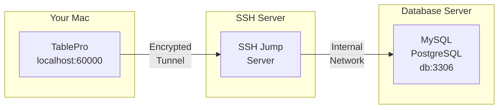

# SSH Tunnel

SSH tunneling cho phép bạn kết nối an toàn đến các database trên server từ xa không thể truy cập trực tiếp từ Mac của bạn. TablePro tạo một tunnel được mã hóa thông qua SSH server để kết nối đến database.

## Cách SSH Tunneling Hoạt Động



1. TablePro tạo kết nối SSH đến jump server của bạn
2. Một cổng cục bộ (ví dụ: 60000) được chuyển tiếp qua tunnel
3. Lưu lượng được mã hóa giữa Mac của bạn và SSH server
4. SSH server kết nối đến database thay mặt bạn

## Khi Nào Sử Dụng SSH Tunneling

- Database server nằm trong mạng nội bộ
- Database server chỉ chấp nhận kết nối cục bộ
- Bạn cần mã hóa kết nối đến database
- Bạn muốn truy cập database thông qua bastion/jump host

## Thiết Lập SSH Tunneling

<Steps>
  <Step title="Tạo hoặc Chỉnh Sửa Kết Nối">
    Mở form kết nối cho database của bạn
  </Step>
  <Step title="Bật SSH Tunnel">
    Bật công tắc **SSH Tunnel**
  </Step>
  <Step title="Cấu Hình SSH Settings">
    Nhập chi tiết SSH server và xác thực
  </Step>
  <Step title="Kiểm Tra và Kết Nối">
    Nhấp **Test Connection** để xác minh tunnel hoạt động
  </Step>
</Steps>

{/* Screenshot: Connection form with SSH section expanded */}
<Frame caption="Cấu hình SSH tunnel">
  
  
</Frame>

## Tùy Chọn Cấu Hình SSH

### Thiết Lập SSH Server

| Field | Mô tả | Mặc định |
|-------|-------------|---------|
| **SSH Host** | Hostname hoặc IP của SSH server | - |
| **SSH Port** | Cổng SSH server | `22` |
| **SSH User** | Tên người dùng SSH | - |

### Phương Thức Xác Thực

TablePro hỗ trợ hai phương thức xác thực SSH:

<Tabs>
  <Tab title="Password">
    Xác thực mật khẩu đơn giản:

    | Field | Mô tả |
    |-------|-------------|
    | **SSH Pass** | Mật khẩu SSH của bạn |

    <Warning>
    Xác thực bằng mật khẩu kém an toàn hơn xác thực bằng key. Hãy cân nhắc sử dụng SSH key cho server production.
    </Warning>
  </Tab>
  <Tab title="Private Key">
    Xác thực bằng key an toàn hơn:

    | Field | Mô tả |
    |-------|-------------|
    | **Key File** | Đường dẫn đến private key của bạn (ví dụ: `~/.ssh/id_rsa`) |
    | **Passphrase** | Passphrase của key (nếu được mã hóa) |

    <Tip>
    Nhấp **Browse** để chọn file private key. TablePro tìm trong `~/.ssh/` theo mặc định.
    </Tip>
  </Tab>
</Tabs>

{/* Screenshot: Phương thức xác thực SSH */}
<Frame caption="Xác thực SSH: Tùy chọn Mật khẩu và Private Key">
  
  
</Frame>

### Sử Dụng SSH Config

Nếu bạn có các entry trong file `~/.ssh/config`, TablePro có thể sử dụng chúng:

1. TablePro đọc SSH config của bạn tự động
2. Chọn một host từ dropdown **SSH Host**
3. Các thiết lập được tự động điền từ config của bạn

Ví dụ SSH config entry:

```
# ~/.ssh/config
Host production-jump
    HostName jump.example.com
    User deploy
    Port 22
    IdentityFile ~/.ssh/production_key
```

Entry này xuất hiện như "production-jump" trong dropdown SSH Host.

{/* Screenshot: SSH host từ config */}
<Frame caption="Các host SSH được nhập từ ~/.ssh/config">
  
  
</Frame>

## Thiết Lập Kết Nối Database

Khi sử dụng SSH tunneling, database host là tương đối với SSH server:

| Field | Giá trị | Mô tả |
|-------|-------|-------------|
| **Host** | `localhost` hoặc `127.0.0.1` | Database nằm trên chính SSH server |
| **Host** | `db.internal` | Database nằm trên mạng nội bộ |
| **Port** | `3306`, `5432`, v.v. | Cổng database (không đổi) |

<Note>
Database host nên là giá trị mà SSH server sử dụng để kết nối đến database, không phải giá trị mà Mac của bạn sử dụng.
</Note>

### Các Trường Hợp Phổ Biến

#### Database trên SSH Server

Database chạy trên cùng máy với SSH server:

```
SSH Host:       jump.example.com
SSH User:       deploy

Database Host:  localhost
Database Port:  3306
```

#### Database trên Mạng Nội Bộ

Database nằm trên server khác, chỉ có thể truy cập từ SSH server:

```
SSH Host:       jump.example.com
SSH User:       deploy

Database Host:  db.internal.example.com
Database Port:  5432
```

#### AWS RDS qua Bastion

Kết nối đến RDS thông qua EC2 bastion host:

```
SSH Host:       bastion.example.com
SSH User:       ec2-user
Key File:       ~/.ssh/aws-key.pem

Database Host:  mydb.abc123.us-east-1.rds.amazonaws.com
Database Port:  5432
```

## Thiết Lập SSH Key

### Tạo SSH Keys

Nếu bạn chưa có SSH key:

```bash
# Tạo key pair mới
ssh-keygen -t ed25519 -C "your_email@example.com"

# Hoặc sử dụng RSA để tương thích rộng hơn
ssh-keygen -t rsa -b 4096 -C "your_email@example.com"
```

### Vị Trí Key

Vị trí key mặc định trên macOS:

| Loại Key | Private Key | Public Key |
|----------|-------------|------------|
| Ed25519 | `~/.ssh/id_ed25519` | `~/.ssh/id_ed25519.pub` |
| RSA | `~/.ssh/id_rsa` | `~/.ssh/id_rsa.pub` |
| ECDSA | `~/.ssh/id_ecdsa` | `~/.ssh/id_ecdsa.pub` |

### Thêm Key vào Server

Sao chép public key của bạn đến SSH server:

```bash
# Sử dụng ssh-copy-id
ssh-copy-id -i ~/.ssh/id_ed25519.pub user@server

# Hoặc thủ công
cat ~/.ssh/id_ed25519.pub | ssh user@server "mkdir -p ~/.ssh && cat >> ~/.ssh/authorized_keys"
```

### Quyền Key

SSH key phải có quyền chính xác:

```bash
# Sửa quyền
chmod 700 ~/.ssh
chmod 600 ~/.ssh/id_*
chmod 644 ~/.ssh/id_*.pub
chmod 644 ~/.ssh/config
```

## Khắc Phục Sự Cố

### Từ Chối Kết Nối

**Triệu chứng**: "Connection refused" khi kiểm tra SSH tunnel

**Nguyên nhân và Giải pháp**:

1. **SSH server không chạy**
   ```bash
   # Kiểm tra kết nối SSH trực tiếp
   ssh -v user@server
   ```

2. **Sai cổng**
   - Xác minh cổng SSH (một số server sử dụng cổng không chuẩn)
   - Kiểm tra với quản trị viên server

3. **Firewall chặn kết nối**
   - Đảm bảo cổng 22 (hoặc cổng tùy chỉnh) được mở
   - Kiểm tra cả firewall cục bộ và server

### Xác Thực Thất Bại

**Triệu chứng**: "SSH authentication failed" hoặc "Permission denied"

**Đối với Xác thực Mật khẩu**:
1. Xác minh username và password
2. Kiểm tra xem xác thực mật khẩu có được bật trên server không
3. Thử kết nối qua terminal: `ssh user@server`

**Đối với Xác thực Key**:
1. Xác minh đường dẫn file key chính xác
2. Kiểm tra quyền key (`chmod 600`)
3. Đảm bảo public key nằm trong `authorized_keys` của server
4. Xác minh passphrase (nếu key được mã hóa)
5. Thử kết nối qua terminal:
   ```bash
   ssh -i ~/.ssh/your_key user@server
   ```

### Lỗi Private Key

**"Private key file not found"**:
- Xác minh đường dẫn tồn tại
- Sử dụng nút Browse để chọn file

**"Private key file is not readable"**:
```bash
chmod 600 ~/.ssh/your_key
```

**"Wrong passphrase"**:
- Nhập lại passphrase
- Kiểm tra key thủ công: `ssh-keygen -y -f ~/.ssh/your_key`

### Tunnel Thiết Lập Nhưng Database Lỗi

Nếu SSH tunnel kết nối nhưng kết nối database thất bại:

1. **Xác minh database host chính xác** (tương đối với SSH server)
   ```bash
   # Từ SSH server, kiểm tra kết nối database
   ssh user@server "mysql -h localhost -u dbuser -p"
   ```

2. **Kiểm tra cổng database**
   - Đảm bảo cổng khớp với cổng thực tế của database server

3. **Xác minh thông tin đăng nhập database**
   - Username/password có thể khác với thông tin SSH

### Tunnel Bị Ngắt Định Kỳ

TablePro bao gồm thiết lập keep-alive để ngăn tunnel bị ngắt:

- `ServerAliveInterval=60` - Gửi keep-alive mỗi 60 giây
- `ServerAliveCountMax=3` - Ngắt kết nối sau 3 lần không phản hồi

Nếu tunnel vẫn bị ngắt:
1. Kiểm tra độ ổn định mạng
2. Xác minh thiết lập `ClientAliveInterval` của server
3. Kiểm tra thiết lập idle timeout trên firewall

{/* Screenshot: SSH tunnel đang hoạt động */}
<Frame caption="Chỉ báo trạng thái SSH tunnel đang hoạt động">
  
  
</Frame>

## Cân Nhắc Bảo Mật

### Thực Hành Tốt Nhất

1. **Sử dụng xác thực bằng key** thay vì mật khẩu
2. **Sử dụng key Ed25519 hoặc RSA** với 4096+ bit
3. **Bảo vệ private key** bằng passphrase
4. **Giới hạn truy cập SSH** cho người dùng/IP cụ thể trên server
5. **Sử dụng jump host chuyên dụng** thay vì truy cập database trực tiếp

### Những Gì Được Mã Hóa

| Dữ liệu | Được mã hóa |
|------|-----------|
| Kết nối SSH | Có |
| Thông tin đăng nhập database | Có (qua tunnel) |
| Dữ liệu query | Có (qua tunnel) |
| Mật khẩu lưu cục bộ | Có (macOS Keychain) |

### Những Điều Cần Tránh

- Không chia sẻ private key
- Không sử dụng xác thực mật khẩu trên server production
- Không lưu mật khẩu SSH ở dạng plain text
- Không để lộ cổng database trực tiếp ra internet

## Nâng Cao: SSH Agent

Nếu bạn sử dụng SSH Agent để quản lý key:

1. Thêm key vào agent:
   ```bash
   ssh-add ~/.ssh/id_ed25519
   ```

2. TablePro có thể sử dụng key từ SSH Agent tự động
3. Bạn không cần nhập passphrase nhiều lần

## Các Bước Tiếp Theo

<CardGroup cols={2}>
  <Card title="Kết nối MySQL" icon="database" href="/vi/databases/mysql">
    Thiết lập và tính năng MySQL cụ thể
  </Card>
  <Card title="Kết nối PostgreSQL" icon="database" href="/vi/databases/postgresql">
    Thiết lập và tính năng PostgreSQL cụ thể
  </Card>
  <Card title="Quản lý Kết nối" icon="plug" href="/vi/databases/overview">
    Quản lý tất cả các kết nối của bạn
  </Card>
  <Card title="Phím tắt" icon="keyboard" href="/vi/features/keyboard-shortcuts">
    Tăng tốc quy trình làm việc
  </Card>
</CardGroup>
